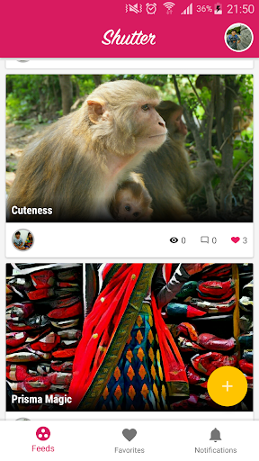
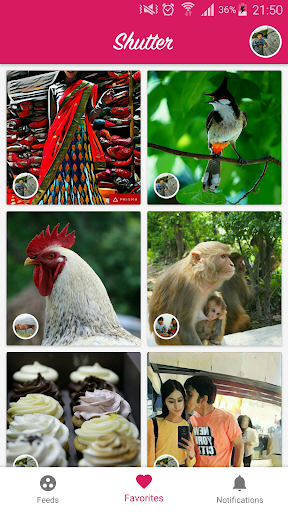
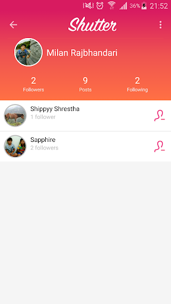

# Shutter

Shutter is a simple app that brings and connects photographers with you. Whether you are a photographer trying to inspire others or someone in need of inspiration, we hope we can make them happen. Help us grow our community by uploading your best shots.

If you are looking for inspiration with our trending photos, Shutter also works as a Muzei source. To enable it first go to your profile, open settings and enable Muzei. After that, go to Muzei and select Shutter as a source.

We are still in alpha stage of development. We will appreciate your feedback to constantly improve Shutter.

## Screenshots

### Play Store feature

### Play Store listing

